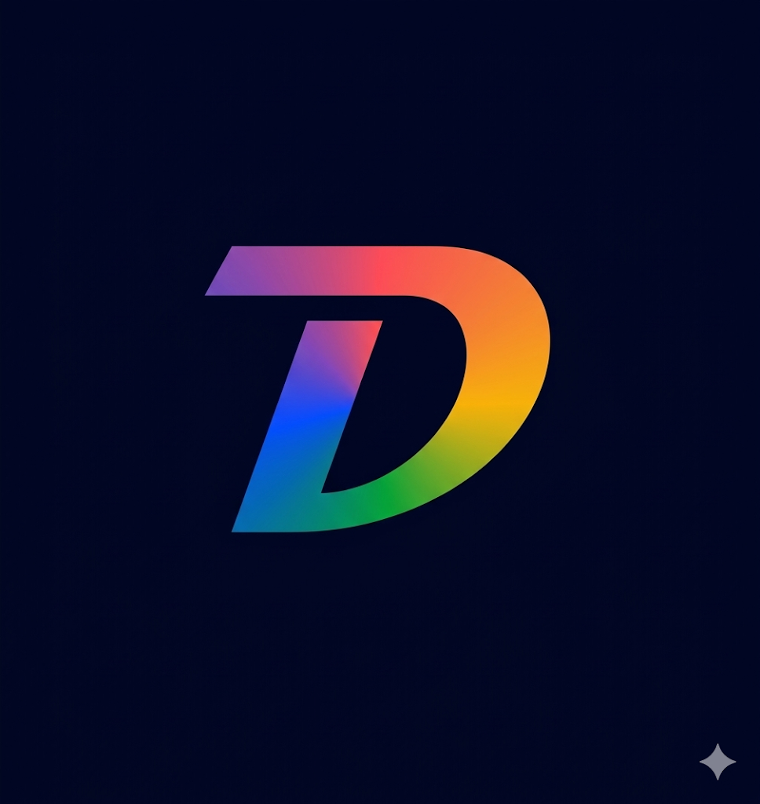

# Demos Messenger

<p align="center">
  
</p>

<p align="center">
  <b>Private messenger with E2EE, voice/video calls, and multi-language support</b>
</p>

<p align="center">
  
  
  
  
</p>

---

## Features

| Category | Details |
|----------|---------|
| **Messaging** | 1-on-1 and group chats, message editing, forwarding, pinning, reply |
| **E2EE** | End-to-end encryption via Signal Protocol (libsignal) with safety number verification |
| **Calls** | Voice and video calls powered by WebRTC |
| **Identity** | UUID-based public ID, unique nickname, AI avatar name, wallet address (confidential) |
| **Search** | Privacy-aware search by public ID or AI name — results never leak cross-identity data |
| **Localization** | Full Russian / English support with in-app language switcher |
| **Theming** | Light, dark, and system themes with accent color customization |
| **Wallpapers** | Custom chat backgrounds (Love, Star Wars, Doodles, Math patterns) |
| **Notifications** | Firebase Cloud Messaging with granular notification settings |
| **Security** | Biometric app lock, screen security, read receipts control |
| **Media** | Photo/video sharing, voice messages, file attachments, link previews |

## Architecture

```
lib/
├── core/
│   ├── e2ee/            # Signal Protocol encryption, key management
│   ├── models/          # Data models (User, Conversation, Message, Call)
│   ├── network/         # Dio HTTP client, WebSocket (STOMP) client
│   ├── providers.dart   # Riverpod state management (auth, theme, locale)
│   ├── services/        # Firebase, pending messages, user search
│   ├── storage/         # SharedPreferences, FlutterSecureStorage
│   ├── theme/           # App colors, light/dark theme definitions
│   └── widgets/         # Reusable UI components (avatar, backgrounds, lock)
├── features/
│   ├── auth/            # Login screen
│   ├── call/            # WebRTC voice/video call screen
│   ├── conversation/    # Chat screen, message bubbles
│   ├── group/           # Group creation, group info
│   ├── home/            # Main screen (chats, calls, telepathy tabs)
│   ├── placeholders/    # Telepathy, Path (future features)
│   ├── profile/         # User profile view
│   └── settings/        # Settings, appearance, privacy, notifications, etc.
├── l10n/                # ARB localization files (EN/RU)
├── app.dart             # MaterialApp, routing (GoRouter)
└── main.dart            # Entry point
```

**Key patterns:**
- **State management** — Riverpod (StateNotifier + Provider)
- **Routing** — GoRouter with declarative routes
- **Networking** — Dio with interceptors (JWT, Accept-Language) + STOMP over WebSocket
- **Local storage** — SharedPreferences (settings) + FlutterSecureStorage (tokens, keys)

## Tech Stack

| Layer | Technology |
|-------|-----------|
| Framework | Flutter 3.x / Dart 3.x |
| State | Riverpod 2.x |
| HTTP | Dio 5.x |
| WebSocket | STOMP (stomp_dart_client) |
| WebRTC | flutter_webrtc |
| Encryption | libsignal_protocol_dart, cryptography |
| Navigation | GoRouter |
| Push | Firebase Messaging + Local Notifications |
| Storage | SharedPreferences, FlutterSecureStorage |
| i18n | flutter_localizations + ARB files |

## Getting Started

### Prerequisites

- Flutter SDK `>=3.11.1`
- Android Studio / Xcode
- A running backend server (API + WebSocket)

### Setup

```bash
# Clone the repository
git clone https://github.com/SayfullakhonovKomilkhon/messenger_dart.git
cd messenger_dart

# Install dependencies
flutter pub get

# Generate localization files
flutter gen-l10n

# Run on connected device
flutter run
```

### Configuration

Update the backend URL in `lib/core/constants.dart`:

```dart
static const String baseUrl = 'https://your-server.com/api/v1';
static const String wsUrl  = 'wss://your-server.com/ws';
```

### Build APK

```bash
flutter build apk --release
```

Output: `build/app/outputs/flutter-apk/app-release.apk`

## Localization

The app supports **Russian** and **English**. Language files are located in `lib/l10n/`:

| File | Language |
|------|----------|
| `app_ru.arb` | Russian (default) |
| `app_en.arb` | English |

Users can switch languages in **Settings → Language**.

## Project Info

- **Package name:** `com.messenger.messenger`
- **Min Android SDK:** 21 (Android 5.0)
- **Target Android SDK:** 35
- **iOS deployment target:** 12.0
